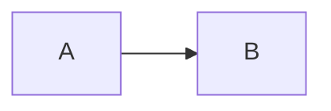

# 中文导出验证

这是一段包含**粗体**、_斜体_、~~删除线~~、[站内链接](#表格)和[安全链接](https://example.com)的中文正文。

> 引用内容应保留为 Word 引用样式。

3. 从三开始
   - 嵌套项目甲
   - 嵌套项目乙
4. 后续项目

- [x] 已完成任务
- [ ] 未完成任务

## 表格

| 项目 | 状态              | 说明       |
| ---- | ----------------- | ---------- |
| 中文 | 完成              | 可编辑表格 |
| Code | `const value = 1` | 行内代码   |

```ts
export const answer = 42
```




---

结束标记：SLIDEMIND_PANDOC_P0_END
